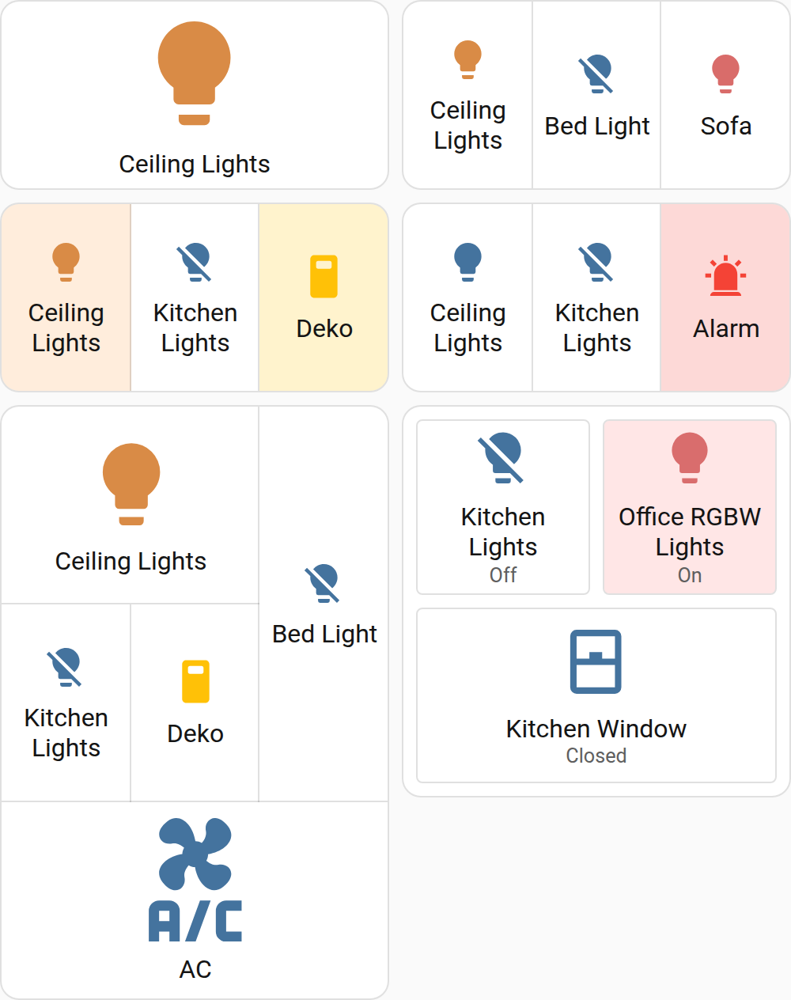
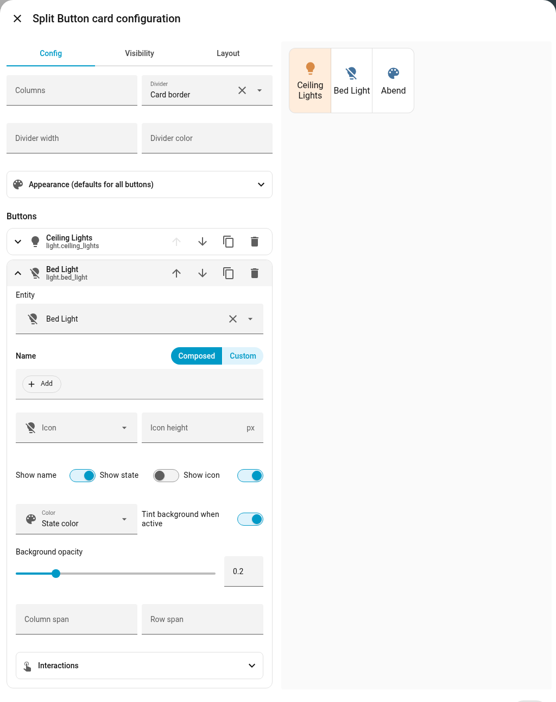

# Split Button Card

[](https://hacs.xyz/docs/faq/custom_repositories)
[](https://github.com/Hudint/split-button-card/actions/workflows/build.yml)

A Home Assistant dashboard card that looks exactly like the native **button card**, but is split into multiple sub-buttons. Every sub-button has its own icon, name, entity, color and actions.

<picture>
  <source media="(prefers-color-scheme: dark)" srcset="docs/screenshot-dark.png">
  
</picture>

## Features

- Pixel-identical to the native button card: same icon sizing, ripple, focus ring, theme variables and state colors.
- Takes the same space as a native button in section dashboards (6 × 2), so it can replace one 1:1.
- Free grid layout with `columns`, plus `span` / `row_span` per sub-button.
- Dividers that match the card border by default, or short lines, gaps or nothing.
- State coloring of icon and/or background, with custom colors and opacity.
- `tap_action`, `hold_action` and `double_tap_action` with all standard Home Assistant actions.
- Per-button visibility conditions: the card hides itself when no button is visible.
- Custom pictures, JavaScript templates (button-card syntax) and animations per button.
- Visual editor: configure everything in the dashboard UI, no YAML needed.

## Installation

### HACS

1. HACS → ⋮ → *Custom repositories* → add `https://github.com/Hudint/split-button-card` with type **Dashboard**.
2. Install **Split Button Card** and reload the browser.

### Manual

1. Download `split-button-card.js` from the [latest release](https://github.com/Hudint/split-button-card/releases/latest) and copy it to `/config/www/`.
2. Settings → Dashboards → ⋮ → *Resources* → add `/local/split-button-card.js` as **JavaScript module**.

## Configuration

### Visual editor

Add the card via *Add card → Split Button Card* and configure it in the UI. Buttons can be added, reordered, duplicated and removed; each one uses the same entity, icon, color and action pickers as the native button card. Options on the card act as defaults for all buttons.



### YAML

```yaml
type: custom:split-button-card
buttons:
  - entity: light.living_room
  - entity: light.kitchen
    name: Küche
  - name: Szene
    icon: mdi:palette
    tap_action:
      action: perform-action
      perform_action: scene.turn_on
      target:
        entity_id: scene.evening
```

### Card options

| Option               | Type    | Default           | Description                                                                                          |
| -------------------- | ------- | ----------------- | ---------------------------------------------------------------------------------------------------- |
| `buttons`            | list    | **required**      | The sub-buttons, see below.                                                                          |
| `columns`            | number  | number of buttons | Grid columns. Further buttons wrap into additional rows.                                             |
| `divider`            | string  | `border`          | `border`: lines like the card border · `line`: short inset lines · `gap`: separate tiles · `none`   |
| `divider_width`      | string  | card border width | Width of the divider lines, e.g. `2px`.                                                              |
| `divider_color`      | string  | card border color | Color of the divider lines (any CSS color).                                                          |
| `gap`                | string  | `8px`             | Spacing for `divider: gap`.                                                                          |

These options can be set on the card as default for all buttons, and overridden per button:
`show_name`, `show_icon`, `show_state`, `icon_height`, `color`, `state_color`, `state_background`, `background_opacity`, `show_entity_picture`, `state_display`, `animation`.

### Button options

| Option               | Type    | Default                                            | Description                                                                                         |
| -------------------- | ------- | -------------------------------------------------- | --------------------------------------------------------------------------------------------------- |
| `entity`             | string  |                                                    | Entity shown and controlled by this button.                                                         |
| `name`               | string  | entity name                                        | Text below the icon.                                                                                |
| `icon`               | string  | entity icon                                        | Any `mdi:` icon.                                                                                    |
| `show_name`          | boolean | `true`                                             |                                                                                                     |
| `show_icon`          | boolean | `true`                                             |                                                                                                     |
| `show_state`         | boolean | `false`                                            | Show the entity state below the name.                                                               |
| `icon_height`        | string  |                                                    | e.g. `48px`.                                                                                        |
| `color`              | string  | state color                                        | Color when active: a theme color (`amber`, `red`, `primary`, …) or any CSS color. Without an entity it is always applied. |
| `state_color`        | boolean | `true`                                             | Color the icon by state, like the native button.                                                    |
| `state_background`   | boolean | `false`                                            | Tint the background with the state color while active.                                             |
| `background_opacity` | number  | `0.2`                                              | Opacity of the background tint.                                                                     |
| `entity_picture`     | string  |                                                    | Picture URL shown instead of the icon, e.g. `/local/waste/yellow.png`.                              |
| `show_entity_picture`| boolean | `false`                                            | Show the entity's own picture (e.g. person, media player) instead of the icon.                     |
| `state_display`      | string  | formatted state                                    | Text shown as state. Plain text or a JavaScript template, see below.                               |
| `animation`          | string  |                                                    | `bounce`, `pulse`, `shake` or `blink`.                                                              |
| `visibility`         | list    |                                                    | Conditions like the card [visibility](https://www.home-assistant.io/dashboards/cards/#showing-or-hiding-a-card-conditionally) option. Conditions without `entity` use the button's entity. |
| `span`               | number  | `1`                                                | Grid columns this button occupies.                                                                  |
| `row_span`           | number  | `1`                                                | Grid rows this button occupies.                                                                     |
| `tap_action`         | action  | `toggle` for toggleable entities, else `more-info` | Standard [Home Assistant action](https://www.home-assistant.io/dashboards/actions/).               |
| `hold_action`        | action  | `more-info`                                        |                                                                                                     |
| `double_tap_action`  | action  | `none`                                             |                                                                                                     |

### Templates

`name`, `icon`, `color`, `entity_picture` and `state_display` accept JavaScript templates in [button-card](https://github.com/custom-cards/button-card#javascript-templates) syntax, so existing templates can be copied over. Available variables: `entity` (the button's entity), `states`, `hass`, `user`.

```yaml
state_display: |
  [[[
    const days = Number(entity.state);
    if (days === 0) return "Heute";
    if (days === 1) return "Morgen";
    return `in ${days} Tagen`;
  ]]]
color: "[[[ return Number(entity.state) === 0 ? 'red' : 'orange'; ]]]"
```

### Styling

Fonts can be adjusted with CSS variables, e.g. with [card-mod](https://github.com/thomasloven/lovelace-card-mod):

```yaml
card_mod:
  style: |
    ha-card {
      --sbc-name-font-weight: 600;
      --sbc-name-font-size: 16px;
      --sbc-state-font-size: 14px;
    }
```

Also available: `--sbc-state-font-weight`.

## Examples

### Waste collection

Only bins picked up within the next two days are shown; the card disappears when none is due.

```yaml
type: custom:split-button-card
show_state: true
state_background: true
background_opacity: 1
icon_height: 52px
animation: bounce
state_display: |
  [[[
    const days = Number(entity.state);
    if (Number.isNaN(days)) return entity.state;
    if (days < 0) return "Vorbei";
    if (days === 0) return "Heute";
    if (days === 1) return "Morgen";
    return `in ${days} Tagen`;
  ]]]
buttons:
  - entity: sensor.waste_collection_schedule_gelbe_tonne
    name: Gelbe Tonne
    entity_picture: /local/waste/yellow.png
    color: "#645d16"
    visibility:
      - condition: numeric_state
        below: 3
  - entity: sensor.waste_collection_schedule_altpapier
    name: Altpapier
    entity_picture: /local/waste/blue.png
    color: "#022845"
    visibility:
      - condition: numeric_state
        below: 3
```

### Cover control

```yaml
type: custom:split-button-card
divider: line
buttons:
  - name: Hoch
    icon: mdi:arrow-up
    tap_action:
      action: perform-action
      perform_action: cover.open_cover
      target: { entity_id: cover.living_room }
  - name: Stop
    icon: mdi:stop
    tap_action:
      action: perform-action
      perform_action: cover.stop_cover
      target: { entity_id: cover.living_room }
  - name: Runter
    icon: mdi:arrow-down
    tap_action:
      action: perform-action
      perform_action: cover.close_cover
      target: { entity_id: cover.living_room }
```

### Lights with background tint

```yaml
type: custom:split-button-card
state_background: true
buttons:
  - entity: light.ceiling
  - entity: light.kitchen
  - entity: switch.decoration
    name: Deko
```

### Grid with spans

```yaml
type: custom:split-button-card
columns: 3
buttons:
  - entity: light.ceiling
    span: 2
  - entity: light.bed
    row_span: 2
  - entity: light.kitchen
  - entity: switch.decoration
  - entity: climate.living_room
    span: 3
```

### Separate tiles

```yaml
type: custom:split-button-card
divider: gap
columns: 2
buttons:
  - entity: light.kitchen
    show_state: true
  - entity: light.office
    show_state: true
  - entity: cover.kitchen_window
    show_state: true
    span: 2
```

## Development

```bash
npm install
npm run build        # → dist/split-button-card.js
npm run watch        # rebuild on change
./dev/start-ha.sh    # local Home Assistant with demo entities on http://127.0.0.1:18123
```

Releases are built by GitHub Actions: publishing a GitHub release attaches `split-button-card.js` to it, which HACS then installs.
